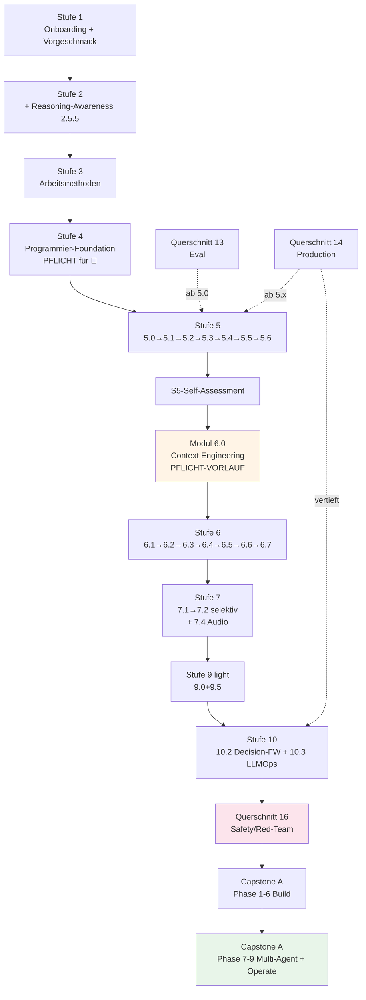
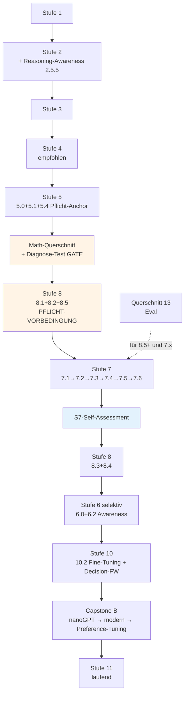
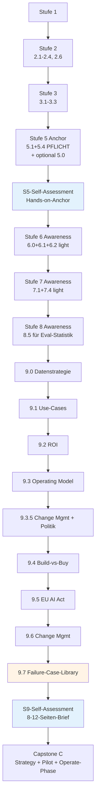

# KI-Meisterlehrplan v2.2

**Vom Beginner zum Meister — strukturiert, praxisnah, evidenz-basiert.**

**Version:** 2.2.0 · **Last verified:** Mai 2026 · **Re-check by:** Aug 2026 (3-Monats-Zyklus für volatile Module, siehe `99_anhang.md`)

> **Was ist neu in v2.2 gegenüber v2.1?** Frontier-Themen 2026 wurden integriert (Context Engineering, Skills-Pattern, Reasoning-Modelle als Architektur-Familie, Agentenschwärme, Agentic OS, Distributed Training, Audio/Voice-AI, Video-Generation-Awareness, Structured Outputs, RAG-Frontier-Patterns, Claude Agent SDK), AI Safety / Red-Teaming als neuer technischer Querschnitt ergänzt, Failure-Case-Library für 💼 hinzugefügt. Plus: ehrliche Aufwand-Bandbreiten ("optimistisch / realistisch / mit Pufferung"), Express-Pfade pro Track, Track-Sequenzdiagramme. **Vollständiges Mapping siehe `00_inventar_v2_1_zu_v2_2.md`.**

---

## Über dieses Curriculum

Dieses Curriculum führt dich vom KI-Anfänger zum souveränen KI-Profi — mit klarem Praxis-Anker, modernen Inhalten (Mai 2026), und einem Format, das mit dir mitwächst.

**Was dieses Curriculum nicht ist:**
- Kein "in 30 Tagen zum KI-Experten" — das ist Marketing.
- Kein "lerne erst alle Mathematik, dann Praxis" — das ist nicht motivierend.
- Kein "kauf dir teure Kurse" — alle Inhalte basieren auf kostenlosen oder Open-Source-Ressourcen.

**Was es ist:**
- Ein selbst-gepacter Lehrplan, den du in Monaten bis Jahren durchläufst.
- 11 Stufen + 4 Querschnitte + 3 Capstone-Optionen.
- Modular: jedes Modul mit eigenem Aufwand, eigenem Outcome-Check.
- Track-flexibel: nach deiner Tiefen-Ambition skalierbar.
- Mit messbarer Outcome-Rubrik pro Track (siehe unten) — du kannst objektiv prüfen, wo du stehst.

---

## Track-Wahl

Drei Tiefen-Markierungen, die du **pro Modul** wählst — kein Forking, ein Hauptpfad mit anpassbarer Tiefe:

- **🔧 Engineer** — du baust KI-Anwendungen für Production. Mathematik solide, aber nicht akademisch tief. Schwerpunkt: bauen, deployen, härten.
- **🧮 Foundations** — du verstehst KI tief auf Modell-Ebene. Mathematik vollständig, eigenes Foundation-Modell-Training. Schwerpunkt: verstehen, forschen, fine-tunen.
- **💼 Strategist** — du führst KI-Initiativen in Organisationen. Mathematik konzeptionell, Praxis ausreichend für Stakeholder-Gespräche, Datenstrategie und Change Management auf Operating-Model-Niveau. Schwerpunkt: bewerten, entscheiden, skalieren.
- **🥇 Meister** — alle drei kombiniert. Maximaler Aufwand, maximaler Wert.

Die meisten Lernenden landen bei einer dominanten Wahl plus Elemente eines anderen Tracks.

**Aufwand-Übersicht (gesamt, ohne Capstone) — drei ehrliche Bandbreiten** *(NEU in v2.2)*:

| Track | Optimistisch *(beim ersten Mal alles sitzt, kein Beruf nebenbei)* | Realistisch *(typische Lerner mit echtem Alltag)* | Mit Pufferung *(berufsbegleitend mit Unterbrechungen, Wiederholungen)* |
|---|---|---|---|
| 🔧 Engineer | 300-475h | **390-620h** | 470-740h |
| 🧮 Foundations | 670-1110h | **870-1440h** | 1050-1730h |
| 💼 Strategist | 375-540h | **490-700h** | 590-840h |
| 🥇 Meister | 1100-1700h | **1430-2210h** | 1720-2660h |

**Plus Capstone:** 80-220h zusätzlich je nach Track. Mit der Operate-Phase als Goldstandard-Empfehlung für Capstone A: zusätzlich 40-80h für 4-6 Wochen Betrieb mit echten Nutzern.

**Lies das richtig:** Die fettgedruckte mittlere Spalte ist die ehrlich erwartbare Realität. Die linke Spalte ist Selbsttäuschung. Die rechte ist die Bandbreite, mit der du planen solltest, wenn du einen Vollzeit-Job hast oder das Curriculum abends/am Wochenende durchziehst. *(In v2.1 war nur die optimistische Spalte angegeben; das war ein systematischer Aufwand-Bias gegen die Lernenden.)*

**Wenn die realistische Aufwand-Schätzung zu hoch ist:** siehe Sektion **"Express-Varianten pro Track"** weiter unten. Express-Pfade reduzieren Pflicht-Inhalt mit ehrlich angepasster Outcome-Rubrik — das ist besser als Vollvariante mit Abbruch.

**💼-Track-Begründung (unverändert aus v2.1):** 350-500h optimistisch sind bewusste Differenzierung gegenüber Bootcamps; Track 💼 zielt auf den anspruchsvollen KI-Strategen mit Praxis-Anker, nicht auf den Bootcamp-Manager. Datenstrategie und Change Management sind eigene Module, plus Operating-Model-Vertiefung.

---

## Outcome-Rubrik pro Track *(NEU in v2.1, in v2.2 um Frontier-Punkt 7 erweitert)*

Statt "umfassender KI-Profi" als unscharfes Versprechen: pro Track 7 messbare Kompetenzen *(in v2.2 von 6 auf 7 erweitert um Frontier-Themen 2026)*. Du erfüllst sie nicht durch Modul-Abschluss, sondern durch Demonstration im Portfolio.

### 🔧 Engineer — Outcome-Rubrik

1. **Eine produktive RAG-Anwendung mit Eval-Pipeline gebaut, deployed und mit Cost-Tracking betrieben.** Nachweis: Repo + Live-URL + Eval-Report (≥ 50 Test-Cases, dokumentierte Metriken über mindestens 4 Wochen).
2. **Einen Multi-Agent-Workflow mit Trajectory-Eval und Failure-Mode-Analyse umgesetzt.** Nachweis: Repo + Trajectory-Logs + Anti-Pattern-Reflexion ("wo hätte ich kein Multi-Agent gebraucht").
3. **Mindestens einen MCP-Server selbst gebaut und gegen mindestens drei MCP-Konsumenten getestet.** Nachweis: Server-Repo + MCP-Sicherheits-Audit (Auth, Rate-Limits, Tool-Description-Injection-Tests).
4. **Cost-Audit für eigene KI-Anwendung erstellt.** Nachweis: Modell-Routing-Strategie + Token-Pricing-Analyse + Multi-Model-Vergleich + dokumentierte Optimierungs-Entscheidungen.
5. **Production-Hardening-Checkliste auf eigenen Capstone angewendet.** Nachweis: Sandboxing, Idempotenz, Rollback-Plan, Incident-Response-Runbook, Monitoring-Setup.
6. **EU-AI-Act-Compliance für eigenen Use-Case dokumentiert.** Nachweis: Risiko-Klassifizierung + Compliance-Mappings + DSGVO-Bewusstsein.
7. **Frontier-Engineering-Disziplin demonstriert** *(NEU in v2.2)* — mindestens drei der folgenden fünf: (a) Context-Engineering-Pipeline mit Token-Budget + Compaction (Modul 6.0), (b) eigene Skill nach SKILL.md-Pattern gebaut und gegen Eval-Cases getestet (Modul 5.6), (c) Schwarm-vs-Conductor-Vergleich auf eigenem Use-Case mit Trajectory-Eval (Modul 6.6), (d) Red-Team-Pass mit ≥20 dokumentierten Angriffen + ≥3 Mitigations (Querschnitt 16), (e) Reasoning-Modell-vs-Standard-Vergleich auf eigenem Capstone-Pfad mit Cost+Latenz+Quality-Tabelle (Modul 7.5).

**Self-Assessment-Schwellen:**
- Ende Stufe 5: 1 + 4 müssen erfüllbar sein.
- Ende Stufe 6: 2 + 3 müssen erfüllbar sein.
- Capstone-Abschluss: alle 7. *(7. ist neu in v2.2 — wer v2.1 abgeschlossen hat, holt 7 als v2.2-Patch nach.)*

### 🧮 Foundations — Outcome-Rubrik

1. **Backpropagation auf Papier ohne Hilfsmittel ableiten können** für ein 2-Layer-Netz mit ReLU.
2. **Klassisches ML solide:** Logistic Regression from scratch implementiert (Forward, Backward, Gradient Descent), Bias-Variance-Tradeoff praktisch demonstriert, Cross-Validation methodisch korrekt durchgeführt. *(In v2.1 als Voraussetzung für Stufe 7 verankert.)*
3. **Eigenes Sprachmodell trainiert** auf eigenem Korpus — mindestens nanoGPT-Niveau, BF16, mit dokumentiertem Training-Run (Loss-Kurven, Hyperparameter-Begründung, Hardware-Realität).
4. **Preference-Tuning experimentell durchgeführt** (DPO oder ORPO) auf eigenem Pretraining-Modell mit selbst gebauten Präferenz-Daten.
5. **Transformer-Komponenten implementiert** und im Detail erklärt: Attention, RoPE oder ALiBi, GQA, KV-Cache. Nicht nur Black-Box-Nutzung.
6. **Evidence-basiertes Lesen** von mindestens 5 Foundational-Papern aus 2024-2026 (z.B. ein Paper aus jeder Kategorie: Architektur, Training, Eval, Alignment, Reasoning) mit eigener Zusammenfassung im Portfolio.
7. **Frontier-Foundations-Disziplin demonstriert** *(NEU in v2.2)* — beide der folgenden zwei: (a) Reasoning-Modell-Familie verstanden mit eigenem GRPO- oder ähnlichem Mini-Run + Eval-Vergleich (Modul 7.5), (b) Multi-GPU-Training mit FSDP oder vergleichbarer Strategie auf einem 7B-Modell durchgeführt mit Throughput/Memory/Cost-Vergleich gegen Single-GPU (Modul 7.6).

**Self-Assessment-Schwellen:**
- Ende Stufe 7: 1 + 5 müssen erfüllbar sein.
- Vor Stufe 7 (NEU in v2.1, Math-Diagnose-Gate): Math-Diagnose-Test bestanden + 2 substanziell vorhanden.
- Capstone-Abschluss: alle 7. *(7. ist neu in v2.2.)*

### 💼 Strategist — Outcome-Rubrik

1. **Use-Case-Portfolio mit ROI-Quantifizierung** für eine reale Organisation erstellt — mindestens 5 Cases priorisiert, mindestens 1 davon im Pilot umgesetzt. *Pflicht: reale Org als Partner (eigener Arbeitgeber, NGO, Verein) — fiktive Orgs zählen nicht.*
2. **Datenstrategie für eine Organisation entworfen** *(NEU in v2.1, Modul 9.0)* — Datenreife-Assessment, Data Governance, Lock-in-Risiken, Daten-als-Voraussetzung-für-KI.
3. **Operating Model + Skalierungs-Plan** mit konkreten Strukturen, KPIs und Governance-Mechaniken erstellt. *(In v2.1 vertieft.)*
4. **Build-vs-Buy-Entscheidung methodisch begründet** für mindestens 2 Use-Cases mit TCO-Modell, Lock-in-Bewertung, Wettbewerbsvorteil-Analyse.
5. **EU-AI-Act-Compliance-Plan** für die Organisation erstellt — Risiko-Klassen, organisatorische Pflichten, Übergangsfristen.
6. **Change-Management-Konzept** *(NEU in v2.1, Modul 9.6)* — Stakeholder-Mapping, Adoption-Curve, Widerstands-Patterns, Schulungs- und Kommunikationsstrategie.
7. **Empirisch fundierte Risiko-Reflexion** *(NEU in v2.2, Modul 9.7)* — eigenen Capstone-C-Use-Case gegen Top-Failure-Patterns aus dokumentierten DE/EU-2024-2026er Fällen getestet, Mitigations-Plan integriert. Nachweis: 8+ analysierte Cases mit Failure-Mode-Klassifikation, eigene Risiko-Mapping-Tabelle im Capstone-Brief.

**Plus mindestens minimaler Hands-on-Anchor:** Eigenständig mindestens eine RAG-App gebaut (Modul 5.1) und mit Eval-Pipeline ausgewertet (Modul 5.4) — ohne diesen Praxis-Boden ist die Strategie hohl.

**Self-Assessment-Schwellen:**
- Ende Stufe 5: Hands-on-Anchor erfüllt.
- Ende Stufe 9: 1 + 2 + 5 müssen erfüllbar sein.
- Capstone-Abschluss: alle 7. *(7. ist neu in v2.2.)*

### 🥇 Meister — Outcome-Rubrik

Alle Outcomes der drei Tracks erfüllt **plus** ein Cross-Track-Capstone (siehe Capstone-Datei): ein Projekt, das Engineer-, Foundations- und Strategist-Kompetenzen integriert.

---

## Mid-Stage-Self-Assessments *(NEU in v2.1)*

Bisher trug der Capstone allein die Last der Outcome-Validierung. In v2.1 gibt es drei Mid-Stage-Self-Assessments, die du als Mini-Capstones absolvierst, bevor du in die nächste Phase gehst.

| Self-Assessment | Wann | Aufwand | Inhalt | Ziel |
|---|---|---|---|---|
| **S5-Self-Assessment** | Ende Stufe 5 | 8-12h | Eine eigenständige RAG-Anwendung mit Eval-Pipeline + Cost-Heuristik + kurzer Lessons-Learned-Reflektion. | Track-Realismus prüfen: kannst du tatsächlich bauen, was Stufe 5 versprochen hat? |
| **S7-Self-Assessment** *(nur 🧮)* | Ende Stufe 7 | 10-15h | Implementation-Übung "Backprop auf Papier + nanoGPT-Mini-Variante mit eigener Anpassung" + Reflektion zu Math-Diagnose-Test. | Foundations-Tiefe vor Stufe 8 prüfen. |
| **S9-Self-Assessment** *(primär 💼, optional andere)* | Ende Stufe 9 | 12-18h | Use-Case-Portfolio + Datenstrategie-Skizze + ROI-Modell für reale (oder klar definierte hypothetische) Organisation. | Strategie-Reife vor Capstone C prüfen. |

Self-Assessments sind keine Prüfungen — sie sind dein eigener Gate-Mechanismus. Wenn du eines nicht bestehst, gehst du eine Stufe zurück, statt überfordert in die nächste zu gehen.

Empfehlung: Self-Assessments im Portfolio-Repo als eigenständige Ordner (`stufe-5_self-assessment/`, etc.) mit README dokumentieren — auch das ist Teil der Lerner-Geschichte und für Recruiter wertvoll.

---

## Stufen-Übersicht *(angepasst in v2.1, erweitert in v2.2)*

**Lese-Hinweis:** Die Aufwand-Spalten zeigen die **realistische** Schätzung *(mittlere Spalte aus der Track-Aufwand-Tabelle oben)*. Für optimistische und mit-Pufferung-Schätzungen siehe Sektion "Track-Wahl" oben. Module mit *(NEU v2.2)* sind in dieser Iteration ergänzt — wer von v2.1 migriert, holt sie nach (siehe `00_inventar_v2_1_zu_v2_2.md` für Detail-Mapping).

| # | Stufe | Aufwand 🔧 | Aufwand 🧮 | Aufwand 💼 | Datei |
|---|---|---|---|---|---|
| 1 | Onboarding & Mindset *(+ Vorgeschmack-Demo)* | 6-9h | 6-9h | 6-9h | `01_stufe1.md` |
| 2 | Grundlagen *(+ Cost-Awareness-Block, + Reasoning-Prompting, + Reasoning-Awareness-Block 2.5.5 NEU v2.2)* | 41-60h | 56-80h | 31-43h | `02_stufe2.md` |
| 3 | Arbeitsmethoden mit KI | 20-30h | 15-25h | 25-35h | `03_stufe3.md` |
| 4 | Programmier-Foundation *(Pflicht für 🔧)* | 30-50h | 30-50h | 0-15h | `04_stufe4.md` |
| 5 | Anwendungen bauen *(+ 5.0 Eval-Mini, + MCP-Sicherheit, + S5-Self-Assessment, + RAG-Frontier-Block 5.1 NEU v2.2, + Structured Outputs + Claude Agent SDK in 5.2 NEU v2.2, + 5.6 Skills-Pattern NEU v2.2)* | 79-129h | 67-106h | 39-61h | `05_stufe5.md` |
| 6 | Agenten *(+ 6.0 Context Engineering NEU v2.2 Pflicht-Vorlauf, + 6.5 Computer Use, + Trajectory-Eval Pflicht, + Claude Agent SDK in 6.4 NEU v2.2, + 6.6 Agentenschwärme NEU v2.2, + 6.7 Agentic OS NEU v2.2)* | 72-117h | 58-93h | 30-55h | `06_stufe6.md` |
| 7 | Deep Learning Foundations *(+ Math-Diagnose-Gate für 🧮, + Klassisches-ML-Voraussetzungen, + S7-Self-Assessment, + Audio/Voice + Video-Awareness in 7.4 NEU v2.2, + 7.5 Reasoning-Architektur NEU v2.2, + 7.6 Distributed Training NEU v2.2)* | 70-116h | 245-413h | 13-25h | `07_stufe7.md` |
| 8 | Klassisches ML & Statistik *(+ Eval-Anker, für 🧮: 8.1+8.2+8.5 sind Voraussetzung für Stufe 7)* | 30-50h | 80-120h | 15-25h | `08_stufe8.md` |
| 9 | KI-Strategie & Business *(+ 9.0 Datenstrategie, + 9.6 Change Management, + 9.3 verstärkt, + S9-Self-Assessment, + 9.7 Failure-Case-Library NEU v2.2)* | 28-45h | 21-35h | 88-142h | `09_stufe9.md` |
| 10 | Spezialisierung & Production *(+ Fine-Tuning-Decision-Framework, + Eval-as-CI-Verstärkung)* | 60-100h | 80-120h | 30-50h | `10_stufe10.md` |
| 11 | Forschung & Cutting-Edge | laufend | laufend | laufend | `11_stufe11.md` |

**Reihenfolge-Hinweise:**

- 🔧 **Stufe 4 ist Pflicht vor Stufe 5** *(NEU in v2.1)*. Wer Modul 5.x ohne Modul 4.1 startet, kollidiert in der Praxis. Das war in v2.0 eine bekannte Falle.
- 🧮 **Module 8.1, 8.2, 8.5 sind Pflicht-Voraussetzung für Stufe 7** *(NEU in v2.1)*. Klassisches ML als Foundation vor Deep Learning. Begründung in Architektur-Entscheidungen unten.
- 🧮 **Math-Diagnose-Test ist Gate vor Stufe 7** *(NEU in v2.1)*. Nicht JIT — Diagnose vorher, Lücken schließen, dann starten. Siehe `12_querschnitt_math.md`.
- 💼 **Hands-on-Anchor in Stufe 5 ist Pflicht.** Strategie ohne Bau-Erfahrung ist Theater. Mindestens Modul 5.1 + 5.4 (oder Modul 5.0).
- **Modul 6.0 Context Engineering ist Pflicht-Vorlauf zu 6.1-6.5 für alle Tracks** *(NEU in v2.2)*. Wer Agents ohne Context-Engineering-Disziplin baut, baut auf 2024er-Niveau.

---

## Querschnitte (Just-in-Time)

Querschnitte sind nicht Stufen, sondern parallele Vertiefungs-Ressourcen, die du heranziehst, wenn du sie brauchst:

| Querschnitt | Wann nötig | Datei |
|---|---|---|
| 🧮 Math-Foundation *(+ Diagnose-Test als Gate für 🧮)* | ab Stufe 7 (für 🧮 vorher), Diagnose-Test vor Stufe 7 | `12_querschnitt_math.md` |
| ✅ Eval | ab Modul 5.0 (Mini-Block), vertieft ab Modul 5.4, mit Ankern in S6/S8/S10/Capstone | `13_querschnitt_eval.md` |
| 🚀 Production & LLMOps | ab Stufe 5 als Bewusstsein, vertieft in Stufe 10, mit Capstone-Operate-Phase als Goldstandard | `14_querschnitt_production.md` |
| 🛡️ AI Safety / Red-Teaming *(NEU in v2.2)* | ab Modul 5.3 (MCP-Sicherheits-Block) als Bewusstsein, vertieft vor Capstone-Operate-Phase, technische Disziplin (nicht regulatorisch — Compliance steckt in 9.5) | `16_querschnitt_safety.md` |

> **Renumbering-Hinweis v2.2:** Der neue Safety-Querschnitt liegt auf File-Index **16**. Die Capstone-Files sind in v2.2 von 15/16/17 auf **17/18/19** verschoben. Querverweise in v2.1-Modulen wie "siehe `15_capstone_a_engineer.md`" werden in v2.2 aktualisiert auf `17_capstone_a_engineer.md` etc. Wer manuell migriert: siehe `00_inventar_v2_1_zu_v2_2.md` für Mapping-Tabelle.

---

## Capstone-Projekte

Drei Capstone-Optionen plus eine Meister-Option:

| Capstone | Track | Datei |
|---|---|---|
| Production-Multi-Agent-RAG | 🔧 Engineer | `17_capstone_a_engineer.md` |
| nanoGPT mit Preference-Tuning | 🧮 Foundations | `18_capstone_b_foundations.md` |
| KI-Strategie + Pilot (mit realer Organisation) | 💼 Strategist | `19_capstone_c_strategist.md` |
| Cross-Track-Capstone | 🥇 Meister | siehe `19_capstone_c_strategist.md` (Anhang) oder `17_capstone_a_engineer.md` |

**Aus v2.1 unverändert: Operate-Phase als Goldstandard-Empfehlung** für Capstone A. Nach Build-and-Deploy: 4-6 Wochen Betrieb mit echten Nutzern, Cost-Tracking, Incident-Log, Eval-Drift-Monitoring. Markiert als "Goldstandard, nicht Pflicht" — wer Capstone A mit Operate-Phase abschließt, hat ein Recruiter-relevantes Differenzierungsmerkmal.

**NEU in v2.2: Capstone-A bekommt Phasen 7c/7d/7e** — Schwarm-vs-Conductor-Vergleich (optional, baut auf Modul 6.6), Agentic-OS-Layer (optional, baut auf Modul 6.7), Red-Team-Pass (Pflicht für Operate-Phase-Goldstandard, baut auf Querschnitt 16). Details siehe `17_capstone_a_engineer.md`.

**Capstone C bleibt: reale Organisation als Partner ist Pflicht** (eigener Arbeitgeber, NGO, Verein). Fiktive Orgs zählen nicht — Strategie ohne realen Stakeholder-Druck bleibt akademisch.

---

## Architektur-Entscheidungen v2.2

Diese Entscheidungen prägen das Curriculum. Punkte 1–10 unverändert aus v2.0, Punkte 11–17 sind aus v2.1, Punkte 18–24 sind neu in v2.2.

1. **Track-Logik**: Tiefen-Markierungen pro Modul, kein Forking. Du gehst alle Stufen, mit gewählter Tiefe.
2. **Self-paced**: Aufwand pro Modul, kein "X Monate"-Versprechen.
3. **Open-Source-Hybrid**: Closed-Source-Standards plus OSS gleichberechtigt, jedes Modul mit OSS-Pfad. Keine Bezahl-Inhalte als Pflicht. Coursera-Materialien (DeepLearning.AI) im Audit-Modus kostenlos nutzbar — siehe `99_anhang.md`.
4. **Free-Zertifikate** plus Curriculum-interne Outcome-Schwellen.
5. **Aktualität**: Datumsstempel pro Modul, 🟢/🔄-Markierungen für stabil/veränderlich, Live-Quellen für volatile Bereiche. *(In v2.1: 3-Monats-Audit-Zyklus für volatile A-Module, Verfallsdatum pro 🔄-Bullet — siehe `99_anhang.md`.)*
6. **Just-in-Time-Math**: Mathematik als Querschnitt, nicht als Pre-Stufe. *(In v2.1 für 🧮 modifiziert: Diagnose-Test als Gate vor Stufe 7, weil JIT ohne Vorwissen für 🧮 nicht trägt.)*
7. **Eval als Querschnitt**: nicht Anhängsel, sondern Disziplin durch alle Stufen. *(In v2.1 verstärkt: Eval-Mini-Block als Modul 5.0 vor erstem RAG-Bau, plus explizite Eval-Anker in Stufen 6/8/10/Capstone.)*
8. **Production als Querschnitt**: Production-Bewusstsein früh, Vertiefung in Stufe 10. *(In v2.1: Cost-Awareness-Block bereits in Stufe 2, Capstone-Operate-Phase als Goldstandard.)*
9. **MCP als roter Faden**: konzeptionell in 2.5, Praxis in 5.3, Produktiv in 10.3. *(In v2.1 erweitert: Sicherheits-Block in 5.3, A2A/ACP-Awareness als Bullet in 5.3.)*
10. **Capstone durchgehend**: nicht am Ende, sondern startet in Stufe 5/7/9 je nach Track.
11. **Math-Sequenz**: ~~Klassisches ML (Stufe 8) **nach** Deep Learning (Stufe 7), als didaktischer Rückblick.~~ → **Geändert in v2.1:** Klassisches-ML-Kern (Module 8.1, 8.2, 8.5) ist **Pflicht-Voraussetzung für Stufe 7 für 🧮**. Begründung: Backprop ist Spezialfall von Gradient Descent, das im Logistic-Regression-Kontext zuerst sauber gelernt wird (Standard in DeepLearning.AI, CS229). Für 🔧 und 💼 ist die Reihenfolge weniger kritisch, da Tiefenstufen leichter — bleibt dort sequenziell.
12. **Strategie nach Praxis**: Stufe 9 (Strategie) erst nach Stufen 5-6 (Praxis) — Strategie ohne Substrat ist Theater. *(Unverändert.)*
13. **Outcome-Rubriken pro Track** *(NEU in v2.1, in v2.2 um Frontier-Punkt 7 erweitert)*: messbare Kompetenz-Kriterien statt unscharfes "Meister"-Versprechen.
14. **Mid-Stage-Self-Assessments** *(NEU in v2.1)*: Outcome-Validierung verteilt auf Stufen 5/7/9, nicht erst im Capstone.
15. **Stufe 4 ist Pflicht für 🔧** *(NEU in v2.1)*: war in v2.0 "optional", was zu Crashes in Stufe 5 führte.
16. **💼-Track als anspruchsvoller Strategen-Track** *(NEU in v2.1)*: 350-500h, mit Datenstrategie, Change Management, vertieftem Operating Model. Bewusste Differenzierung gegen Bootcamp-Niveau.
17. **Aktualisierungs-Mechanik mit Verfallsdatum** *(NEU in v2.1)*: pro 🔄-Bullet ein eigenes Verfallsdatum, nicht nur pro Modul. 3-Monats-Audit für volatile A-Module.
18. **Context Engineering als eigenständige Disziplin und Pflicht-Vorlauf zu Agents** *(NEU in v2.2)*: Modul 6.0 wird Pflicht-Vorlauf zu 6.1-6.5 für alle Tracks. Begründung: Anthropic hat 2025 Context Engineering als Nachfolger von Prompt Engineering proklamiert; moderne Agents scheitern nicht an Prompt-Qualität, sondern an Context-Strategie. Ohne diesen Vorlauf ist Stufe 6 didaktisch unvollständig.
19. **Skills-Pattern als eigene Disziplin** *(NEU in v2.2)*: Modul 5.6 etabliert Skills (Claude Skills, Codex Skills, Hamel evals-skills) als eigene Kategorie zwischen Prompt, MCP-Tool und System-Prompt. Pflicht für 🔧, empfohlen für 🧮/💼.
20. **Reasoning-Modelle als Architektur-Familie** *(NEU in v2.2)*: Modul 7.5 behandelt Test-Time-Compute als eigene Skalierungs-Achse (o3, Claude Thinking, R1, GRPO). Vorlauf als Awareness-Block 2.5.5 in Stufe 2 für alle Tracks. Pflicht für 🧮, optional für 🔧, Awareness für 💼.
21. **Schwarm- und Agentic-OS-Patterns als Stufe-6-Erweiterung** *(NEU in v2.2)*: Module 6.6 (Agentenschwärme: Conductor / Hierarchical / Peer-Swarm / Hybrid) und 6.7 (Agentic OS: Framework-Pattern + System-Layer) als eigene Module nach 6.5. Default-Empfehlung 2026: Hierarchical wins over Swarm in production almost every time — aber Awareness der Pattern-Familie ist Pflicht.
22. **AI Safety / Red-Teaming als technischer Querschnitt** *(NEU in v2.2)*: Querschnitt 16 ergänzt 9.5 (regulatorische Compliance) um die technische Disziplin (OWASP Top 10 LLM, Prompt Injection, Jailbreaking, Tool-Misuse, Red-Team-as-CI). Pflicht für 🔧 vor Capstone-Operate-Phase.
23. **Aufwand-Realismus mit drei Bandbreiten** *(NEU in v2.2)*: Statt einer einzigen optimistischen Schätzung gibt es Track-Tabellen mit "optimistisch / realistisch / mit Pufferung". Default-Lese-Empfehlung: realistische Spalte. Express-Pfade pro Track erlauben kürzere Variante mit ehrlich reduzierter Outcome-Rubrik.
24. **Failure-Case-Library als Empirie-Anker für 💼** *(NEU in v2.2)*: Modul 9.7 ergänzt die methodische 💼-Tiefe um konkrete DE/EU-Fail-Cases 2024-2026 (McDonald's, Klarna, DPD, etc.). Methodik ohne empirische Anker bleibt akademisch — das schließt diese Lücke.

---

## Quick-Start

### Wenn du heute startest

1. **Lies dieses Master-Dokument** komplett (25 Min in v2.2).
2. **Wähle deinen Track** — am besten dominanter Track plus 1-2 Module aus anderem Track. Schau dir die Outcome-Rubrik deines Tracks an: das ist dein Ziel-Bild. **Beachte den neuen 7. Outcome-Punkt für Frontier-Disziplin** *(NEU v2.2)*.
3. **Sei ehrlich mit dem Aufwand:** lies die "realistische" Spalte der Track-Aufwand-Tabelle, nicht die optimistische. Wenn die Realistisch-Schätzung dein Zeitbudget sprengt, prüfe die **Express-Variante deines Tracks** (siehe Sektion weiter unten) statt zu starten und nach 6 Monaten frustriert abzubrechen.
4. **Gehe zu Stufe 1** (`01_stufe1.md`) — etabliere Tools, Portfolio-Repo, GitHub-Setup. Erlebe den Vorgeschmack-Demo (RAG + MCP + Eval), bevor du dich entmutigen lässt.
5. **Plane deinen Rhythmus** — wie viele Stunden pro Woche kannst du dir realistisch nehmen? Siehe Erwartete-Dauer-Tabelle unten — basiert in v2.2 auf realistischen, nicht optimistischen Aufwänden.
6. **Setze einen 3-Monats-Review-Reminder** im Kalender — du wirst kalibrieren wollen.
7. **Für 🧮:** zusätzlich Math-Diagnose-Test in `12_querschnitt_math.md` machen, *bevor* du Stufe 7 erreichst. Nicht erst dann.
8. **Für 💼:** zusätzlich eine reale Organisation als späteren Capstone-Partner identifizieren — eigener Arbeitgeber, NGO, Verein. Ohne reale Org bleibt Capstone C akademisch.
9. **Für alle Tracks (NEU v2.2):** Modul 6.0 Context Engineering ist Pflicht-Vorlauf zu Stufe 6 — nicht überspringen.

### Erwartete Dauer *(in v2.2 mit realistischen Aufwänden, nicht optimistischen)*

Basis: realistische Spalte der Track-Aufwand-Tabelle (mit Capstone und Operate-Phase wo relevant).

| Lerntempo | 🔧 Engineer | 🧮 Foundations | 💼 Strategist | 🥇 Meister |
|---|---|---|---|---|
| **Vollzeit** (40h/Woche) | 3-5 Monate | 9-15 Monate | 4-6 Monate | 14-20 Monate |
| **Berufsbegleitend** (10h/Woche) | 10-18 Monate | 24-42 Monate | 13-20 Monate | 36-54 Monate |
| **Hobby-Tempo** (3-5h/Woche) | 24-50 Monate | 4-7 Jahre | 30-60 Monate | 6-10 Jahre |

**Realistisch sein, nicht abschrecken lassen.** v2.1 hat hier zu optimistische Zahlen genannt; v2.2 korrigiert das. Die Zahlen oben gehen von einer durchgängigen Lernroutine aus — bei längeren Pausen sind 30-50% Aufschlag realistisch (Wiedereinstieg kostet Zeit).

**Wenn die Bandbreiten dich abschrecken:** wechsle auf die Express-Variante deines Tracks (siehe nächste Sektion). Express-Pfade halbieren oft die Dauer mit ehrlich reduzierter Outcome-Rubrik.

---

## Express-Varianten pro Track *(NEU in v2.2)*

Nicht jeder hat 18-30 Monate berufsbegleitend für einen Vollkurs. Die Express-Pfade sind ehrliche, dünnere Variante mit klar reduzierter Outcome-Rubrik. Sie sind keine "Light-Versionen" der Vollvariante — sie sind kürzere, andere Lernziele mit anderem Versprechen.

### 🔧 Engineer Express *(~150-220h realistisch)*

**Pflicht-Module:** 1.1-1.3, 2.1, 2.3, 2.5, 2.7, 4.1, 5.0, 5.1, 5.2 (Auswahl), 5.4, 6.0, 6.1, 6.2, 10.3.

**Outcome-Versprechen:** "RAG-Engineer mit Eval- und Multi-Agent-Grundlagen, Production-Bewusstsein". **Nicht versprochen:** Frontier-Themen vollständig (kein 5.6 Skills, kein 6.6 Schwärme, kein 6.7 Agentic OS, kein Querschnitt 16 Safety-Tiefe), kein Cost-Audit, keine MCP-Server selbst gebaut.

**Capstone-Reduktion:** Capstone-A-light ohne Operate-Phase (nur Build-and-Deploy). Outcome-Rubrik 🔧 reduziert auf Punkte 1, 2, 5 (nicht 3, 4, 6, 7).

### 🧮 Foundations Express *(~250-400h realistisch)*

**Pflicht-Module:** Math-Diagnose-Gate, Math-Querschnitt vollständig, 7.1, 7.2, 8.1, 8.2, 8.5, 10.2 (mit nano-Capstone).

**Outcome-Versprechen:** "DL-Foundations-Verständnis, Klassisches ML solide, modernen Transformer im Detail erklären können". **Nicht versprochen:** Foundation-Modell-Trainer (kein eigenes Pretraining, kein DPO/ORPO auf eigenem Pretraining-Modell, kein Multi-GPU-Training, keine 5 Foundational-Papers-Lektüre).

**Capstone-Reduktion:** Capstone-B-nano statt Capstone-B-voll — kleines Char-Modell auf eigenem Korpus mit RoPE oder GQA, ohne Preference-Tuning. Outcome-Rubrik 🧮 reduziert auf Punkte 1, 2, 5 (nicht 3, 4, 6, 7).

### 💼 Strategist Express *(~150-220h realistisch)*

**Pflicht-Module:** 1.1-1.3, 2.1-2.4, 2.6, 3.1-3.3, 5.1-light + 5.4-light (Hands-on-Anchor minimal), 9.0, 9.1, 9.2, 9.5, 9.6, 9.7.

**Outcome-Versprechen:** "AI-Strategy-aware Manager mit Datenreife-Bewertung, ROI-Methodik, Compliance-Awareness, Failure-Awareness". **Nicht versprochen:** Pilot mit Operate-Phase (kein 4-6 Wochen Real-User-Betrieb), kein vollständiges Operating-Model + KPI-System auf 3 Ebenen, keine Build-vs-Buy-Tiefe.

**Capstone-Reduktion:** Capstone-C-light ohne Pilot-Implementierung (nur Strategie-Dokument + S9-Self-Assessment-Brief). Outcome-Rubrik 💼 reduziert auf Punkte 1 (nur Use-Case-Portfolio ohne Pilot), 2, 5, 7 (nicht 3, 4, 6).

### Was Express *nicht* ist

Express ist nicht "schneller mit gleichem Ergebnis". Express ist eine ehrliche Reduktion: weniger Inhalt, weniger Tiefe, weniger Outcome-Versprechen. Wer Express macht und merkt, dass mehr nötig ist, kann jederzeit auf Vollvariante umstellen — das Curriculum ist modular.

**Express ist explizit besser als Vollvariante mit Abbruch.** Wer realistisch nur 8h/Woche hat und die Vollvariante startet, läuft in 60-70% Wahrscheinlichkeit in Frust und Pause. Express bringt 100% der Express-Outcomes statt 30-40% der Voll-Outcomes.

---

## Track-Sequenzdiagramme *(NEU in v2.2)*

Track-spezifische Pfade durch das Curriculum. Pflicht-Voraussetzungen sind durchgezogene Pfeile, empfohlene Reihenfolge gepunktet, Querschnitte parallel.

### 🔧 Engineer — Vollvariante



### 🧮 Foundations — Vollvariante



### 💼 Strategist — Vollvariante



### 🥇 Meister — Cross-Track

Vollkombination aus 🔧 + 🧮 + 💼 plus Cross-Track-Capstone, das Engineering-, Foundations- und Strategist-Kompetenzen in einem Projekt integriert. Keine eigene Sequenz — Lernender wechselt nach eigenem Tempo zwischen Track-Pfaden, mit Cross-Track-Capstone-Konzept aus `19_capstone_c_strategist.md` (Anhang) als Integrationspunkt.

**Realistische Empfehlung:** Wenn 🥇, dann nicht parallel sondern sequenziell — erst 🔧 Capstone-A bis Operate-Phase, dann 🧮 Foundations-Vertiefung mit Capstone-B-Erweiterung des A-Stacks (z.B. Fine-Tuning des Modells im Capstone-A-Use-Case), dann 💼 mit Capstone-C in einer realen Org, die den 🔧-Stack einsetzen würde.

---

---

## Nutzungs-Hinweise

### Format pro Modul
Jedes Modul folgt einem Standard:
- Kurze Beschreibung (2-4 Sätze)
- Aufwand pro Track
- Datumsstempel (Last verified / Re-check by) — bei volatilen A-Modulen 3-Monats-Zyklus
- Voraussetzungen (in v2.1 mit harten Gates für 🧮 und 🔧 wo nötig)
- Lernziel mit Outcome-Schwelle
- Theorie (Bullets mit 🟢 stabil / 🔄 veränderlich + Quellen-Links + Verfallsdatum bei 🔄)
- Praxis: Hauptprojekt (40%+ Zeit, ins Portfolio)
- 🎁 Mehrwert-Mini-Projekte (sofort nutzbare kleine Tools)
- 🌱 Open-Source-Pfad
- Outcome-Check als Checklist

### Portfolio-Aufbau
Du baust parallel zum Curriculum ein GitHub-Portfolio auf:
- `stufe-1_onboarding/` bis `stufe-11_forschung/` als Hauptordner
- `querschnitte/` für Querschnitt-Outputs
- `00_capstone/` als oberster Capstone-Ordner
- `self-assessments/` für Mid-Stage-Self-Assessments *(NEU in v2.1)*
- Alle Hauptprojekte sind im Portfolio dokumentiert
- README pro Projekt mit Was/Warum/Wie

### Aktualität sicherstellen
- Pro Modul: Datumsstempel beachten ("Last verified: Mai 2026")
- 🔄-Bullets sind Stand-Mai-2026 — bei Bedarf via Live-Quellen verifizieren
- Live-Quellen sind in den Modulen verlinkt
- **3-Monats-Audit-Zyklus für volatile A-Module** *(NEU in v2.1)*: 2.5, 5.1, 5.3, 5.4, 6.2, 6.5, 7.1, 7.2, 10.2, 10.3, Eval-Querschnitt, Production-Querschnitt
- Curriculum gesamt wird mindestens halbjährlich aktualisiert (siehe `99_anhang.md`)

---

## Verzeichnisstruktur *(angepasst in v2.1, in v2.2 erweitert um Querschnitt 16 und Capstone-Renumbering)*

```
KI-Meisterlehrplan/
├── 000_master.md (diese Datei)
├── 00_inventar_v2_0_zu_v2_1.md (v2.0→v2.1-Migrations-Mapping)
├── 00_inventar_v2_1_zu_v2_2.md (v2.1→v2.2-Migrations-Mapping, NEU in v2.2)
├── 01_stufe1.md
├── 02_stufe2.md
├── 03_stufe3.md
├── 04_stufe4.md
├── 05_stufe5.md (in v2.2 erweitert: 5.6 Skills-Pattern, RAG-Frontier, Structured Outputs, Claude Agent SDK)
├── 06_stufe6.md (in v2.2 erweitert: 6.0 Context Engineering Pflicht-Vorlauf, 6.6 Schwärme, 6.7 Agentic OS)
├── 07_stufe7.md (in v2.2 erweitert: 7.4 Audio + Video, 7.5 Reasoning-Architektur, 7.6 Distributed Training)
├── 08_stufe8.md
├── 09_stufe9.md (in v2.2 erweitert: 9.7 Failure-Case-Library)
├── 10_stufe10.md
├── 11_stufe11.md
├── 12_querschnitt_math.md
├── 13_querschnitt_eval.md
├── 14_querschnitt_production.md
├── 16_querschnitt_safety.md (NEU in v2.2: AI Safety / Red-Teaming als technische Disziplin)
├── 17_capstone_a_engineer.md (vormals 15 in v2.1, in v2.2 verschoben)
├── 18_capstone_b_foundations.md (vormals 16 in v2.1, in v2.2 verschoben)
├── 19_capstone_c_strategist.md (vormals 17 in v2.1, in v2.2 verschoben)
└── 99_anhang.md (Aktualisierungslog, Aktualisierungs-Mechanik, Repo-Härtung, Glossar)
```

> **Hinweis:** File-Index 15 ist in v2.2 ungenutzt (Lücke zwischen 14_querschnitt_production und 16_querschnitt_safety). Das ist absichtlich, um die Querschnitt-Block-Konsistenz zu wahren (alle Querschnitt-Files in 12-16-Range, Capstones in 17-19-Range).

Plus eine konsolidierte Datei `KI-Meisterlehrplan_v2.2_complete.md`, die alle Einzeldateien zusammenführt — für Lernende, die lieber eine einzige Datei haben.

---

## Was kommt als nächstes?

Wenn dieses Curriculum für dich resoniert:

1. **Mache es zu deinem**: forke das Repo, passe an deine Bedürfnisse an, ergänze eigene Notizen.
2. **Teile es weiter**: das Curriculum ist offen lizenziert (Vorschlag CC BY-SA 4.0, siehe `99_anhang.md`) — KI-Lernen ist kein Wettkampf.
3. **Pflege Aktualität**: bei volatilen Inhalten (Modelle, Tools) Live-Quellen verifizieren statt blind dem Curriculum zu folgen.
4. **Verbinde dich**: lokale KI-Communities, Online-Communities, Reading Groups (siehe Modul 11.1).

**Geplant für v2.3 (Stand Mai 2026):**
- Audio-Praxis-Capstone-Variante als eigene Track-Option neben Capstone A/B/C.
- Multi-Modal-Vertiefung in 7.4 mit eigenständigen Voice-Agent-Patterns.
- Externe Peer-Review-Integration (Discord/GitHub-Issue-Templates) als Pflicht-Anker für S5/S7/S9-Self-Assessments.
- Failure-Case-Library 9.7 als Live-pflegbare Sammlung (community-driven via Repo-PRs).
- Eine Ultra-Light-Variante (~60-80h durch Vorgeschmack-Demo + 5.0 + 5.1 + 9.0-light + 9.5-light) für Lernende, die nur den schnellen Einstieg suchen.

---

## Lizenz und Credits

Vorschlag für die offene Veröffentlichung: **Creative Commons Attribution-ShareAlike 4.0 International (CC BY-SA 4.0)**. Details siehe `99_anhang.md`.

Dieses Curriculum integriert Inhalte und Inspiration aus zahlreichen Quellen, die in den jeweiligen Modulen verlinkt sind. Wichtige Foundations:

- Andrew Ng's Machine Learning Specialization und DeepLearning.AI
- Andrej Karpathy's Zero to Hero und nanoGPT
- Hamel Husain's Eval-Posts (zentrale Pflichtlektüre für Modul 5.0 und Eval-Querschnitt) — und seine *AI Evals FAQ* (Jan 2026) plus *evals-skills* Repo (Mär 2026, Brücke zu Modul 5.6)
- Sebastian Raschka's Magazine
- Anthropic, OpenAI, Google, Hugging Face Documentation
- **Anthropic's "Building Effective Agents"** (Schluntz/Zhang, Dez 2024) und **"Effective Context Engineering for AI Agents"** (2025) als Foundation für Modul 6.0 *(NEU als Quelle in v2.2)*
- **Stanford CS336 — Language Modeling from Scratch** (Spring 2024, Liang/Hashimoto) als Foundations-Vergleichsreferenz für 🧮-Track *(NEU als Quelle in v2.2 — exemplarische Tiefe für Mid-Training, Post-Training, Scaling Laws)*
- Karim Lakhani's Competing in the Age of AI
- Eugene Yan's und Lilian Weng's Blogs
- 3Blue1Brown's Visual Math Series

Plus die Open-Source-Communities, die LangChain, LlamaIndex, vLLM, Ollama, Hugging Face, RAGAS, Promptfoo, Langfuse, Letta (vormals MemGPT), AutoGen, CrewAI, Anthropic Claude Agent SDK, OpenAI Agents SDK und unzählige weitere Tools möglich machen.

---

## Aktualisierungslog

**v2.2.0 — Mai 2026** *(diese Version)*

Diese Version ist das Ergebnis einer zweiten Review-Runde durch dasselbe Bewertungs-Gremium wie v2.1, mit Fokus auf Frontier-Themen 2026, die in v2.1 fehlten oder verstreut waren. Vollständiges Mapping siehe `00_inventar_v2_1_zu_v2_2.md`.

**Strukturelle Änderungen (Welle 1):**
- Aufwand-Schätzungen ehrlich mit drei Bandbreiten (optimistisch / realistisch / mit-Pufferung) statt einer optimistischen Spalte
- Erwartete-Dauer-Tabelle auf realistischen Aufwand kalibriert
- Express-Pfade pro Track ergänzt (🔧 / 🧮 / 💼) mit ehrlich reduzierter Outcome-Rubrik
- Track-Sequenzdiagramme als Mermaid-Visualisierungen ergänzt
- Outcome-Rubrik pro Track von 6 auf 7 messbare Kompetenzen erweitert (Frontier-Punkt)
- Capstones renumberiert von 15/16/17 → 17/18/19 (Lücke 15 für künftige Erweiterung, Querschnitt 16 neu)
- Stanford CS336 als Foundations-Vergleichsreferenz für 🧮 in Credits ergänzt

**Inhaltliche Ergänzungen (Welle 2 — Erweiterungen bestehender Module):**
- Modul 5.1 RAG: Frontier-Block (HyDE, Reasoning-Augmented Retrieval, GraphRAG, ColBERTv2/Late-Interaction, Reranking-Cascades)
- Modul 5.2 Frameworks: Structured Outputs / Constrained Generation als Block + Claude Agent SDK als prominentes Vergleichs-Framework
- Modul 6.4 Vendor-Patterns: Claude Agent SDK Tiefe (Sub-Agent-Spawn, Skills-Integration, Compaction, Session-Management)
- Modul 7.4 Multimodal: Audio/Voice-AI-Block (Whisper, ElevenLabs, OpenAI Realtime API) + Video-Generation-Awareness (Veo 3, Sora, Runway Gen-4)

**Inhaltliche Ergänzungen (Welle 3 — neue Pflicht-Module):**
- Modul 2.5.5 Reasoning-Awareness-Block (Vorlauf zu 7.5)
- Modul 5.6 Skills-Pattern (Claude Skills, Codex Skills, eval-skills)
- Modul 6.0 Context Engineering — **Pflicht-Vorlauf zu Stufe 6 für alle Tracks**
- Modul 6.6 Agentenschwärme (Conductor / Hierarchical / Peer-Swarm / Hybrid)
- Modul 6.7 Agentic OS (Framework-Pattern + System-Layer)
- Modul 7.5 Reasoning-Modelle als Architektur-Familie (o3, Thinking, R1, GRPO)
- Modul 7.6 Distributed Training systematisch (DDP, FSDP, ZeRO, Megatron-Style)
- Modul 9.7 Failure-Case-Library DE/EU 2024-2026
- Querschnitt 16 AI Safety / Red-Teaming als technische Disziplin
- Capstone-A Phasen 7c (Schwarm/Conductor-Vergleich), 7d (Agentic-OS-Layer), 7e (Red-Team-Pass) ergänzt

**Bewusst NICHT in v2.2 umgesetzt (mit Begründung):**
- Voice-Agent-Capstone als eigene Variante: zu früh für stabile Production-Patterns Mai 2026, kommt in v2.3
- Externe Peer-Review-Pflicht: bleibt Empfehlung (für Open-Repo nicht durchsetzbar), Pattern dokumentiert in v2.3-Roadmap
- Kohorten-Modus: nicht realistisch ohne Plattform — bleibt Wunschdenken
- Multi-Modal-Generation (Video, Audio) als eigene Stufe: in 7.4 als Awareness reicht für Mai 2026

---

## Aktualisierungslog v2.1 (Auszug)

**v2.1.0 — Mai 2026**

Diese Version ist das Ergebnis einer strukturierten Review-Runde durch ein Bewertungs-Gremium aus 5 Rollen (Curriculum-Architekt, CTO/Engineering Lead, AI Engineering Spezialist, AI Foundations Spezialist, Applied AI Spezialist) plus Moderator und Research-Assistent. Vollständiger Log siehe `99_anhang.md`.

**Strukturelle Änderungen (Tier 1):**
- Outcome-Rubrik pro Track ergänzt (war in v2.0 unscharf als "Meister"-Versprechen)
- Mid-Stage-Self-Assessments S5/S7/S9 ergänzt (Outcome-Validierung verteilt, nicht nur im Capstone)
- Module 8.1+8.2+8.5 als Pflicht-Voraussetzung für Stufe 7 für 🧮 (Sequenz-Korrektur)
- Stufe 4 von "optional" zu "Pflicht für 🔧 vor Stufe 5"
- Math-Diagnose-Test als Gate vor Stufe 7 für 🧮 (Querschnitt erweitert)
- Capstone-Operate-Phase als Goldstandard-Empfehlung in Capstone A
- 💼-Aufwand auf 350-500h erhöht (bewusste Positionierung)

**Inhaltliche Ergänzungen (Tier 2):**
- Modul 1.3: Vorgeschmack-Demo (RAG + MCP + Eval, generisch)
- Modul 5.0: Eval-Mini-Block (Hamel Husain, API-Hauptpfad + Ollama-OSS-Pfad) — neu
- Modul 6.5: Computer Use & Agentic Browsing — neu
- Modul 9.0: Datenstrategie für KI — neu
- Modul 9.6: Change Management für KI-Initiativen — neu
- Cost-Awareness-Mini-Block vor Modul 2.2
- Reasoning-spezifisches Prompting in Modul 2.5
- A2A/ACP-Awareness und MCP-Sicherheits-Block in Modul 5.3
- Agent-Trajectory-Eval als Pflicht-Block in Modul 6.2
- Eval-Querschnitt-Anker in Stufen 6/8/10/Capstone
- Fine-Tuning-vs-RAG-vs-Prompt-Decision-Framework in Modul 10.2
- Modul 9.3 verstärkt: Operating Model, KPI, Governance

**Pflege & Veröffentlichung (Tier 3):**
- 3-Monats-Aktualitäts-Audit für A-Module
- Verfallsdatum-Stempel pro 🔄-Bullet
- Repo-Veröffentlichungs-Härtung: README-Vorlage, Lizenz-Vorschlag (CC BY-SA 4.0), Contribution-Guide, Issue-Templates
- Coursera-Audit-Modus dokumentiert für DeepLearning.AI-Verlinkungen

**Bewusst NICHT umgesetzt (mit Begründung):**
- RL eigenständig: Modul 6.3 reicht für >95% der Lernenden, Hugging Face RL Course ist verlinkt für Vertiefung
- Audio/Speech eigenständig: Multimodal-Modul 7.4 deckt es ausreichend für Mai 2026
- NLP-Foundations vor LLMs (CS224N-Stil): Aufwand-Nutzen schlecht, optional als Querschnitt-Material verlinkt
- Externe Capstone-Reviewer als Pflicht: für Open-Repo nicht durchsetzbar, bleibt Empfehlung
- Kohorten-Modus: nicht realistisch ohne Plattform

---

**Mai 2026**
